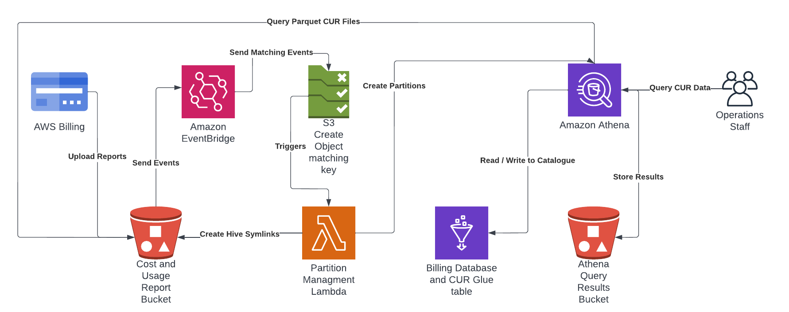

# aws-billing-store

This project automates setup of Cost and Usage Reports (CUR) in a billing account with an Athena table enabling querying of the latest data for each month. This is an alternative to the pre configured athena setup provided by the Billing Team and is more suited to customers with 10s or 100s of CUR files provided in each report.

# Overview

In summary this project deploys:

1. Creates the CUR in the billing service and the bucket which receives the reports.
2. Configures a Glue Database and Table for use by Athena.
3. Deploys a lambda to manage the partitions using eventbridge S3 events.

Once deployed all you need to do is wait till AWS pushes the first report to the solution, this can take up to 8 hours in my experience, then you should be able to log into Athena and start querying the data.



# Why?

The goal of this project is to provide a consistent view of cost and usage reports (CUR) at all times in a Athena table. To do this we use hive symlinks, which are updated each time a new snapshot arrives providing an atomic single file update for new CURs. This is different to the status table provided by AWS Billing team in the pre configured Athena setup.

# How It Works

When you enable the option to keep all versions of the CUR, AWS will upload a new snapshot then once complete update the manifest containing a list of file paths for that billing period. We use an s3 file create event to trigger reading of that manifest and creation of a symlink in the hive directory we maintain in the same bucket. This provides Athena with a partitioned structure to query without worrying about CUR files being updated while it is reading them.


# Prerequisites

1. An AWS account.
2. [AWS SAM CLI](https://docs.aws.amazon.com/serverless-application-model/latest/developerguide/serverless-sam-cli-install.html).
3. Exported environment variables for `AWS_DEFAULT_REGION`, `AWS_REGION` and `AWS_PROFILE`, I use [direnv](https://direnv.net/) to maintain these variables in a `.envrc` file. 

# Deployment

First you will need to deploy the bucket we use to store lambda and CFN artifacts.

```
make deploy-bucket
```

Deploy the solution.

```
make deploy
```

This will deploy the following components:

1. Setup a bucket for the CUR in the region you configured via `AWS_DEFAULT_REGION`.
2. Create a CUR in the billing service.
3. Deploy the Glue database and table used by Athena.
4. Deploy the Athena workspace with an encrypted secure S3 bucket for artifacts.
5. Deploy the template which manages hive symlinks and partitions in Athena when new reports arrive.

# What Next? 

There are some great resources with queries which provide insights from your CUR data, one of the best is [Level 300: AWS CUR Query Library](https://wellarchitectedlabs.com/cost/300_labs/300_cur_queries/) from the [The Well-Architected Labs website](https://wellarchitectedlabs.com/).

# License

This project is released under Apache 2.0 license and is copyright [Mark Wolfe](https://www.wolfe.id.au).